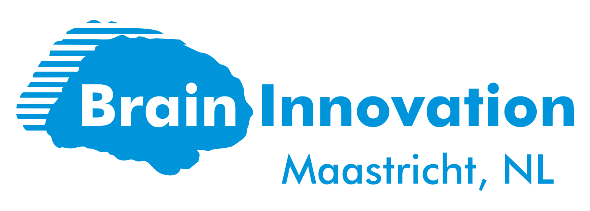

#  *[work in progress...]*

A lightweight Python library for reading & writing [BrainVoyager](https://www.brainvoyager.com/products/brainvoyager.html) file formats.

`bvbabel` is a spiritual successor of Jochen Weber's [Neuroelf](https://neuroelf.net/)'s `xff` function, Thomas Emmerling's unmerged Nibabel [pull request](https://github.com/nipy/nibabel/pull/216), and Hester Breman's earlier efforts around 2005. I have been inspired by these earlier projects, but ended up implementing from scratch based on [BrainVoyager file formats documentation](https://support.brainvoyager.com/brainvoyager/automation-development/84-file-formats).


### File format support overview

| File format | Read  | Write | Create |Test data|
| ------------|-------|-------|--------|---------|
| FMR & STC   | Yes   | Yes   | Yes    |       No|
| DMR         | Yes   | No    | No     |       No|
| GLM         | wip...| No    | No     |      Yes|
| GTC         | Yes   | Yes   | No     |       No|
| MSK         | Yes   | Yes   | No     |       No|
| MTC         | Yes   | Yes   | Yes    |      Yes|
| OBJ         | No    | Yes   | No     |       No|
| POI         | Yes   | Yes   | No     |      Yes|
| PRT         | Yes   | Yes   | No     |       No|
| ROI         | Yes   | No    | No     |       No|
| SRF         | Yes   | wip...| No     |      Yes|
| SMP         | Yes   | Yes   | Yes    |      Yes|
| SSM         | Yes   | No    | No     |       No|
| SDM         | Yes   | Yes   | Yes    |      Yes|
| TRF         | No    | No    | No     |       No|
| V16         | Yes   | Yes   | Yes    |       No|
| VMP         | Yes   | Yes   | Yes    |      Yes|
| VMR         | Yes   | Yes   | Yes    |      Yes|
| VOI         | Yes   | Yes   | No     |      Yes|
| VTC         | Yes   | Yes   | Yes    |      Yes|

## Dependencies

| Required | Package                               | Tested version |
| ---------|---------------------------------------|----------------|
| Yes      | [Python 3](https://www.python.org/)   | 3.7.8          |
| Yes      | [NumPy](http://www.numpy.org/)        | 1.17.2         |
| No       | [NiBabel](https://nipy.org/nibabel/)  | 3.2.0          |

## Installation

1. Clone the latest release and unzip it.
2. Change directory in your command line:
```
cd /path/to/bvbabel
```
3. Install bvbabel:
```
python setup.py install
```
4. Once the installation is complete, you can have a look ant try using some of the example scripts at the [examples](examples/) folder.

## BrainVoyager documentation

- [Overview](https://support.brainvoyager.com/brainvoyager/automation-development/84-file-formats/339-developer-guide-2-6-file-formats-overview)
- [General overview](https://support.brainvoyager.com/brainvoyager/automation-development/84-file-formats/38-general-overview-of-file-formats)
- [File format categories](https://support.brainvoyager.com/brainvoyager/automation-development/84-file-formats/41-file-formats-categorised)

## License
This project is licensed under [MIT](./LICENSE).

## Contributors
Omer Faruk Gulban [@ofgulban](https://github.com/ofgulban)  
Hester Breman [@nausikaa8](https://github.com/nausikaa8)  
Jorie van Haren [@jorievanharen](https://github.com/jorievanharen)  
Judith Eck [@ju-ec](https://github.com/ju-ec)  
Assunta Ciarlo [@assuntaciarlo](https://github.com/assuntaciarlo)  
Michael Lührs [@MichaelUM](https://github.com/MichaelUM)
Caroline Brockhaus [@carbrock](https://github.com/carbrock)  
Chengran Li [@ChengranAA](https://github.com/ChengranAA)

# Acknowledgments
This project is fully supported by [Brain Innovation (Maastricht, NL)](https://www.brainvoyager.com/).

<p align="center">
  
</p>
